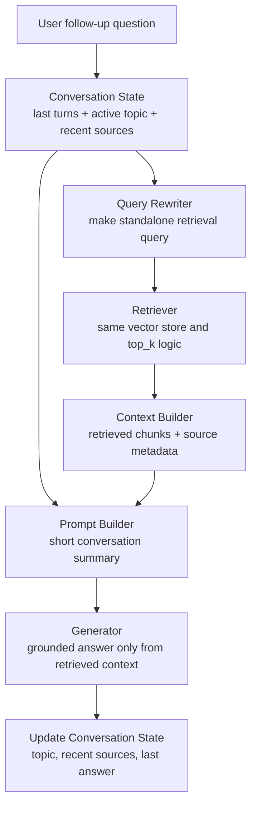

# Conversational Memory Feasibility

This note explores a possible stretch feature for the ProPresenter unofficial guide:

```text
Conversational Memory: Support multi-turn queries where the system remembers context from the previous question.
```

It is a planning document only. It does not implement the feature, change the MVP architecture, or require any pipeline code before the core RAG system is working.

## Feature Summary

Conversational memory would let the guide handle follow-up questions that depend on the previous user turn.

Without memory:

```text
User: How do I make the confidence monitor show lyrics?
Assistant: [Explains Stage Screens.]
User: What about showing the next slide too?
Assistant: [May not know that "it" still means the Stage Screen layout.]
```

With memory:

```text
User: How do I make the confidence monitor show lyrics?
Assistant: [Explains Stage Screens.]
User: What about showing the next slide too?
Assistant: [Understands the follow-up is still about Stage Screen layout items and retrieves accordingly.]
```

For this project, memory should not mean the system remembers everything forever. A better definition is:

> The system keeps a short conversation state for the current session so follow-up questions can be rewritten, retrieved, and answered with the right ProPresenter context.

## Why It Could Help This Domain

ProPresenter support questions are naturally conversational. A volunteer might start with a broad workflow question, then ask several follow-ups:

- "How do I set up lower thirds?"
- "Where do I change the theme for that?"
- "Can I trigger it from a slide?"
- "What if I only want it on the livestream output?"

Those follow-ups use pronouns and shorthand like "that," "it," "there," "same screen," or "the lyrics." A single-turn retriever may treat those follow-ups as vague because important context only exists in the previous turn.

Memory is especially useful for questions involving related ProPresenter concepts:

- Looks and alternate themes.
- Stage Screens and Stage Layouts.
- Audience Screens and Screen Configuration.
- Timers, Messages, and Props.
- Audio Routing and Audio Outputs.
- Macros and slide actions.

## Recommended Scope

The most feasible version is short-term session memory, not long-term user memory.

### In Scope

- Remember the last few user questions and assistant answers during one CLI or app session.
- Track the main topic of the conversation, such as `Stage Screens`, `Looks`, or `Audio Routing`.
- Rewrite follow-up questions into standalone retrieval queries.
- Include a short conversation summary in the generation prompt.
- Preserve normal source grounding: answers still must come from retrieved chunks.

### Out of Scope

- Saving personal user history across sessions.
- Remembering church-specific setup details permanently.
- User accounts, authentication, or profile storage.
- Learning from answers and adding them to the vector store automatically.
- Letting memory override retrieved document evidence.

This scope keeps the feature useful without turning it into a privacy or data-management project.

## Architecture Options

### Option A: Prompt-Only Chat History

The simplest approach is to pass the last few turns directly into the generation prompt along with retrieved context.

Example prompt inputs:

```text
Conversation history:
User: How do I show lyrics on the back monitor?
Assistant: You likely want a Stage Screen...

Current question:
Can I show the next slide there too?

Retrieved context:
Source 1: Using a Stage Screen to its Full Potential
...
```

Pros:

- Easiest to build.
- Works well for very short conversations.
- Does not require another model call.

Cons:

- Retrieval still receives the vague current question unless query rewriting is also added.
- Prompt can grow quickly.
- Irrelevant previous turns can distract the model.

Feasibility: high, but limited.

### Option B: Follow-Up Query Rewriting

Before retrieval, rewrite the current question into a standalone question using recent conversation history.

Example:

```text
History:
User asked about showing lyrics on a confidence monitor.
Assistant explained Stage Screens.

Current question:
Can I show the next slide there too?

Rewritten retrieval query:
In ProPresenter Stage Screen layouts, how can I show the current lyrics and the next slide on the confidence monitor?
```

The rewritten question is used for retrieval, while the original user wording is preserved for the final answer.

Pros:

- Improves retrieval quality for vague follow-ups.
- Keeps the main RAG pipeline mostly unchanged.
- Easy to inspect during debugging.

Cons:

- Requires either an LLM rewrite step or careful rule-based heuristics.
- A bad rewrite can add assumptions the user did not mean.
- Needs logging so mistakes can be diagnosed.

Feasibility: high and likely the best stretch implementation.

### Option C: Structured Conversation State

Maintain a small state object alongside chat history.

Example:

```python
{
    "active_topic": "Stage Screens",
    "active_source_titles": [
        "Using a Stage Screen to its Full Potential"
    ],
    "recent_entities": [
        "confidence monitor",
        "stage layout",
        "next slide"
    ],
    "last_retrieved_chunk_ids": [
        "using-a-stage-screen-to-its-full-potential__003"
    ]
}
```

This state can guide query rewriting, retrieval boosting, and clarifying questions.

Pros:

- More predictable than raw chat history alone.
- Helps boost recently relevant sources.
- Useful for debugging because the state is visible.

Cons:

- More implementation work.
- Requires deciding which topics/entities to track.
- State can become stale if the user changes topics.

Feasibility: medium-high after the MVP is stable.

### Option D: Long-Term Memory

Persist facts about a user or their church setup across sessions.

Example:

```text
This church uses one audience projector, one stage display, and a livestream lower-third output.
```

Pros:

- Could make future answers more personalized.
- Useful for real production support tools.

Cons:

- Not necessary for this project.
- Introduces privacy, storage, editing, and deletion concerns.
- Could make the system overfit to stale setup details.
- Requires a clear user consent model.

Feasibility: low for this project. It is probably not worth doing for the CodePath MVP or stretch feature.

## Recommended Design

The best stretch version is a combination of Option B and a light version of Option C:



This design keeps the current RAG pipeline intact. Conversational memory becomes a wrapper around retrieval and generation:

1. Receive the user's current question.
2. Detect whether it looks like a follow-up.
3. Rewrite it into a standalone retrieval query using recent conversation state.
4. Retrieve chunks using the existing retriever.
5. Generate an answer using retrieved context plus a short conversation summary.
6. Update the session state after the answer.

## Suggested Data Structures

A simple in-memory session could be enough for the first version:

```python
conversation_state = {
    "turns": [
        {
            "role": "user",
            "content": "How do I show lyrics on the confidence monitor?"
        },
        {
            "role": "assistant",
            "content": "Use a Stage Screen layout...",
            "sources": ["Using a Stage Screen to its Full Potential"]
        }
    ],
    "active_topic": "Stage Screens",
    "recent_source_titles": ["Using a Stage Screen to its Full Potential"],
    "recent_chunk_ids": ["using-a-stage-screen-to-its-full-potential__003"]
}
```

For the MVP stretch version, this state can live only in memory while the CLI or app is running. No database is required.

## Follow-Up Detection

The system does not need perfect intent detection. A simple rule-based start could flag likely follow-ups when the user question:

- Contains pronouns like `it`, `that`, `there`, `those`, or `same`.
- Starts with phrases like `what about`, `how about`, `can I also`, `what if`, or `where do I`.
- Is very short and lacks a clear ProPresenter feature name.
- Arrives after a previous answer with strong retrieved sources.

If the system is unsure, it can still rewrite cautiously or ask a clarifying question.

Example clarification:

```text
Do you mean showing the next slide on the Stage Screen layout you were just asking about?
```

## Grounding Rules

Memory should improve context, not replace source evidence.

The generation prompt should still enforce:

- Answer only from retrieved ProPresenter context.
- Use memory only to understand the user's follow-up.
- Do not treat previous assistant answers as authoritative unless the new retrieved context supports them.
- If the rewritten query retrieves weak or unrelated context, ask a clarifying question or say the documents do not contain enough information.

This matters because earlier assistant answers could be incomplete or wrong. The source documents should remain the source of truth.

## Feasibility Assessment

Overall feasibility: medium-high as a stretch feature after the MVP.

| Area | Feasibility | Notes |
| --- | --- | --- |
| Short chat history | High | Easy to store in memory in a CLI or web session. |
| Query rewriting | High | Can be done with an LLM call or simple template/rule-based logic. |
| Retrieval integration | High | Uses the same vector store; the main change is passing a rewritten query. |
| Structured state | Medium | Useful, but requires careful topic/source tracking. |
| Evaluation | Medium | Needs multi-turn test cases instead of only single-turn questions. |
| Long-term memory | Low | Not recommended for this project. |

The feature is feasible because it does not require changing document ingestion, chunking, embeddings, or the vector store. It mostly affects the query handling layer and prompt construction.

## Risks

### Risk 1: Memory Can Pull the System Off Topic

If the user changes topics, stale state could cause the system to rewrite the new question incorrectly.

Example:

```text
User: How do I set up lower thirds?
Assistant: [Looks answer]
User: What about audio outputs?
```

The system should recognize that `audio outputs` is a new topic and avoid forcing it into the Looks conversation.

Mitigation:

- Prefer explicit topic terms in the current question over previous state.
- Reset or soften the active topic when a new ProPresenter feature is named.
- Keep the rewritten query visible in debug logs.

### Risk 2: Rewrites Can Add Unsupported Assumptions

If the user says "Can I do that with a macro?", the system might assume the wrong prior action.

Mitigation:

- Use cautious rewriting.
- Preserve the original question for generation.
- Ask a clarifying question when multiple prior references are plausible.

### Risk 3: Previous Assistant Answers May Become Treated as Truth

If chat history is passed directly into the prompt, the model may rely on its own previous answer instead of the retrieved documents.

Mitigation:

- Label conversation memory separately from retrieved sources.
- Instruct the model that retrieved sources outrank memory.
- Keep memory summaries short and factual.

### Risk 4: Evaluation Gets More Complicated

Single-turn evaluation is easy to grade. Multi-turn evaluation needs sequences and expected behavior at each turn.

Mitigation:

- Add a small separate memory evaluation set.
- Log original question, rewritten query, retrieved sources, and final answer.
- Grade whether the follow-up was resolved correctly, not just whether the final answer sounded good.

## Example Evaluation Cases

### Case 1: Stage Screen Follow-Up

Turn 1:

```text
How do I put lyrics on the confidence monitor for singers?
```

Expected behavior:

- Retrieve Stage Screen documentation.
- Explain that the user likely needs a Stage Screen layout.

Turn 2:

```text
Can it show the next slide too?
```

Expected behavior:

- Rewrite around Stage Screen layouts and next slide display.
- Retrieve Stage Screen layout content.
- Answer using Stage Screen source context.

### Case 2: Looks Follow-Up

Turn 1:

```text
My lower thirds look different from the main lyrics. Where should I check?
```

Expected behavior:

- Retrieve Looks documentation.
- Explain alternate themes for the Presentation layer.

Turn 2:

```text
Can I trigger that from one slide?
```

Expected behavior:

- Understand that "that" refers to a Look Preset or lower-thirds Look change.
- Retrieve the Looks section about adding an Audience Look action to a slide.
- Explain the slide action workflow only if supported by retrieved context.

### Case 3: Topic Change

Turn 1:

```text
How do I create a countdown for the audience screen?
```

Expected behavior:

- Retrieve countdown documentation.

Turn 2:

```text
What do M, S, and T mean in audio routing?
```

Expected behavior:

- Treat this as a new topic because it names audio routing.
- Retrieve Audio Routing documentation.
- Do not blend in countdown context.

## Implementation Timing

This should come after the MVP is complete and evaluated.

Recommended order:

1. Finish single-turn ingestion, chunking, embedding, retrieval, and generation.
2. Run the five planned MVP evaluation questions.
3. Add debug logging for retrieved chunks and scores.
4. Add in-memory chat history to the interface.
5. Add query rewriting for likely follow-ups.
6. Add a small multi-turn evaluation set.
7. Only then consider structured conversation state.

The MVP should stay single-turn until retrieval and grounded generation are reliable. Memory can hide retrieval problems by making answers sound smoother, so it is better to evaluate the baseline first.

## Recommendation

Conversational memory is a good stretch feature for this project, but only in a narrow session-based form.

The best version would:

- Store short-term session history.
- Rewrite follow-up questions before retrieval.
- Track recent source titles and active topic lightly.
- Keep source-grounded generation as the final authority.
- Avoid persistent user memory.

This would make the guide feel much more natural for real ProPresenter troubleshooting while keeping implementation complexity manageable.
