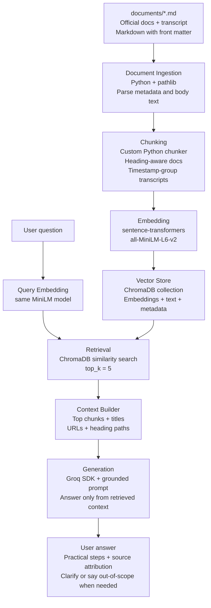

# Pipeline Architecture Analysis

This note describes the planned RAG pipeline architecture for the ProPresenter unofficial guide. It is a planning document only; it does not implement the pipeline or directly update `planning.md`.

The main goal of this document is to clarify the five required pipeline stages so they can be translated into a Mermaid diagram:

```text
Document Ingestion -> Chunking -> Embedding + Vector Store -> Retrieval -> Generation
```

## Architecture Summary

The project will use a local document collection from `documents/` as the source of truth. The documents are already saved as Markdown files with YAML-style front matter containing metadata such as title, source URL, document type, and product.

The pipeline should turn those Markdown files into structured chunks, embed those chunks with `sentence-transformers`, store them in ChromaDB, retrieve the most relevant chunks for a user question, and then send only the retrieved context to a Groq-hosted LLM for grounded answer generation.

The planned MVP stack is:

| Stage | Tool or library | Purpose |
| --- | --- | --- |
| Document Ingestion | Python, `pathlib`, Markdown files in `documents/` | Load local ProPresenter source documents and extract front matter metadata. |
| Chunking | Custom Python chunker | Split official docs by headings and soft headings; split transcripts by timestamp groups. |
| Embedding | `sentence-transformers`, `all-MiniLM-L6-v2` | Convert each chunk into a semantic vector. |
| Vector Store | ChromaDB | Store chunk vectors, text, and metadata for similarity search. |
| Retrieval | ChromaDB cosine similarity, `top_k = 5` | Retrieve the most relevant chunks for a user query. |
| Generation | Groq SDK, grounded system prompt | Generate an answer using only retrieved ProPresenter context. |
| Interface | CLI first; optional Gradio or Streamlit later | Let a user ask questions and view answers with sources. |

## Stage 1: Document Ingestion

### Input

The input is the current `documents/` folder, which contains Markdown files for:

- Official Renewed Vision support articles.
- One YouTube transcript about installing and activating ProPresenter.

Each file has front matter like:

```yaml
---
title: "Using Bibles in ProPresenter"
source: "https://support.renewedvision.com/..."
type: "official_docs"
product: "ProPresenter"
---
```

### Process

The ingestion step should:

1. Read every `.md` file in `documents/`.
2. Separate front matter metadata from Markdown body text.
3. Normalize basic fields such as `title`, `source`, `type`, and `product`.
4. Preserve the source file path for debugging and citations.
5. Pass each parsed document into the chunking stage.

### Output

The output should be a list of document records:

```python
{
    "source_file": "documents/using-bibles-in-propresenter.md",
    "source_url": "https://support.renewedvision.com/...",
    "title": "Using Bibles in ProPresenter",
    "document_type": "official_docs",
    "product": "ProPresenter",
    "body": "Markdown body text..."
}
```

## Stage 2: Chunking

### Input

The chunker receives parsed document records from ingestion.

### Process

Chunking should follow the strategy already planned for this corpus:

- For official documentation, split by Markdown headings such as `#`, `##`, and `###`.
- Treat conservative standalone bold labels as soft headings when they function like section labels.
- Keep heading paths attached to each chunk, such as `Using Bibles in ProPresenter > Bible Slide Options`.
- Keep tables together where possible, especially in the Keyboard Shortcuts article.
- Keep step-by-step lists together where possible.
- Split oversized sections by paragraph, list block, or table block.
- Use about 75-125 tokens of overlap only when an oversized section has to be split.
- For transcript sources, group adjacent timestamp paragraphs and preserve timestamp metadata.

### Output

The chunking stage should produce chunk records:

```python
{
    "chunk_id": "using-bibles-in-propresenter__004",
    "source_file": "documents/using-bibles-in-propresenter.md",
    "source_url": "https://support.renewedvision.com/...",
    "title": "Using Bibles in ProPresenter",
    "document_type": "official_docs",
    "product": "ProPresenter",
    "heading_path": "Using Bibles in ProPresenter > Bible Slide Options",
    "chunk_index": 4,
    "text": "Chunk text...",
    "token_count": 430
}
```

Transcript chunks may also include:

```python
{
    "start_timestamp": "00:01:24",
    "end_timestamp": "00:03:12",
    "start_seconds": 84,
    "end_seconds": 192
}
```

## Stage 3: Embedding and Vector Store

### Input

The embedding stage receives chunk records from the chunker.

### Process

Each chunk should be converted into an embedding-ready text string that includes both metadata and content:

```text
Title: Using Bibles in ProPresenter
Heading: Using Bibles in ProPresenter > Bible Slide Options
Type: official_docs

Chunk text...
```

This is important because short chunks may not contain enough standalone context. Adding the title and heading path helps retrieval match product terms such as Looks, Stage Screens, Bibles, Macros, Media Inspector, Audio Routing, and Audience Screens.

The embedding model should be:

```text
all-MiniLM-L6-v2 via sentence-transformers
```

The vector store should be:

```text
ChromaDB
```

ChromaDB should store:

- `chunk_id`
- embedding vector
- raw chunk text
- source metadata
- heading path
- document type
- timestamps when present

### Output

The output is a persistent ChromaDB collection containing searchable chunk vectors and metadata.

## Stage 4: Retrieval

### Input

The retrieval stage receives a user question.

### Process

The retriever should:

1. Embed the user question with the same `all-MiniLM-L6-v2` model.
2. Query the ChromaDB collection by vector similarity.
3. Start with `top_k = 5`.
4. Return chunk text, metadata, source titles, source URLs, and similarity scores.
5. Optionally filter or warn when retrieval scores are too weak.

The MVP retrieval approach is dense semantic search. This should help with volunteer-style wording, such as retrieving Stage Screen documentation when a user asks about a "confidence monitor."

The main known limitation is that dense retrieval may miss exact UI strings or shortcut-heavy answers. In a later version, the pipeline could add BM25 keyword retrieval, metadata boosting, or reranking.

### Output

The output should be a ranked list of retrieved chunks:

```python
[
    {
        "chunk_id": "using-looks-to-show-different-screen-content-in-propresenter__002",
        "score": 0.82,
        "title": "Using Looks to Show Different Screen Content in ProPresenter",
        "source_url": "https://support.renewedvision.com/...",
        "heading_path": "Using Looks to Show Different Screen Content in ProPresenter > Example Use",
        "text": "Retrieved chunk text..."
    }
]
```

## Stage 5: Generation

### Input

The generation stage receives:

- The user's original question.
- The top retrieved chunks.
- Source metadata for citations or attribution.

### Process

The generator should use the Groq SDK and a grounding-focused system prompt.

The system prompt should tell the model to:

- Answer only using the retrieved ProPresenter context.
- Say when the retrieved context does not contain enough information.
- Ask a clarifying question when the user's request is too vague.
- Avoid giving unrelated general advice.
- Include source attribution using the retrieved document titles or URLs.

The prompt should format retrieved chunks clearly, for example:

```text
Source 1:
Title: Using Looks to Show Different Screen Content in ProPresenter
URL: https://support.renewedvision.com/...
Heading: Example Use
Content:
...
```

### Output

The output should be a grounded answer:

```python
{
    "answer": "Check the Looks window, especially the alternate theme selected for the Presentation layer on the lower-thirds screen...",
    "sources": [
        {
            "title": "Using Looks to Show Different Screen Content in ProPresenter",
            "url": "https://support.renewedvision.com/..."
        }
    ]
}
```

## Mermaid Diagram Draft

This draft can be copied into `planning.md` or adjusted after implementation.



## Implementation Flow

The implementation can be organized into a few scripts or modules:

| File or module | Responsibility |
| --- | --- |
| `ingest.py` | Load Markdown documents, parse front matter, create document records. |
| `chunk.py` | Convert document records into structured chunks. |
| `embed_store.py` | Embed chunks and write them into ChromaDB. |
| `retrieve.py` | Embed a query and retrieve relevant chunks from ChromaDB. |
| `generate.py` | Build the grounded prompt and call Groq. |
| `app.py` or `cli.py` | Provide the user-facing question-answer interface. |

These names are suggestions only. The final implementation can combine smaller pieces if that is simpler for the MVP.

## Data Flow Checklist

A good implementation should preserve these fields all the way from ingestion to final answer:

- `chunk_id`
- `source_file`
- `source_url`
- `title`
- `document_type`
- `product`
- `heading_path`
- `chunk_index`
- `text`
- `token_count`
- `start_timestamp` and `end_timestamp` for transcript chunks

Preserving this metadata matters because the evaluation report needs to explain not only whether the answer was correct, but also whether the right chunks were retrieved.

## Architecture Risks

The most important architecture risks are:

- The chunker may produce chunks that are too broad if it ignores soft headings.
- The retriever may miss shortcut or UI-label questions because dense embeddings are not always strong for exact strings.
- The generator may answer from general knowledge if the grounding prompt is weak.
- Source attribution may break if metadata is dropped before generation.
- The interface may hide retrieval details that are needed for evaluation.

To reduce these risks, the MVP should expose retrieved source titles and scores during testing, even if the final user-facing interface is cleaner.
