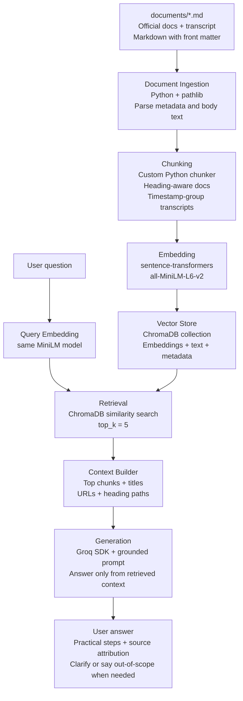

# Project 1 Planning: The Unofficial Guide

> Write this document before you write any pipeline code.
> Your spec and architecture diagram are what you'll use to direct AI tools (Claude, Copilot, etc.) to generate your implementation — the more specific they are, the more useful the generated code will be.
> Update the Retrieval Approach and Chunking Strategy sections if you change your approach during implementation.
> Update this file before starting any stretch features.

---

## Domain

My domain is an unofficial guide for ProPresenter operators in church/media team environments. The guide focuses on practical questions around lyrics, scriptures, stage display, audience screens, looks, props, macros, lower thirds, OBS/ATEM routing, and common Sunday-service troubleshooting. This knowledge is valuable because new volunteers often have to learn ProPresenter through scattered official docs, YouTube tutorials, Reddit threads, and last-minute troubleshooting during service.

---

## Documents

<!-- List your specific sources: URLs, subreddit names, forum threads, or file descriptions.
     Aim for at least 10 sources that together cover different subtopics or perspectives within your domain. -->

| # | Source | Description | URL or location |
|---|--------|-------------|-----------------|
| 1 | YouTube Video | How to Download + Install ProPresenter | https://www.youtube.com/watch?v=7awG_JK6eWo |
| 2 | Official Documentation | Understanding The ProPresenter User Interface | https://support.renewedvision.com/hc/en-us/articles/360041345954-Understanding-The-ProPresenter-User-Interface |
| 3 | Official Documentation | Keyboard Shortcuts in ProPresenter | https://support.renewedvision.com/hc/en-us/articles/360042123293-Keyboard-Shortcuts-in-ProPresenter |
| 4 | Official Documentation | Using Bibles in ProPresenter | https://support.renewedvision.com/hc/en-us/articles/360041347594-Using-Bibles-in-ProPresenter |
| 5 | Official Documentation | Using a Stage Screen to its Full Potential | https://support.renewedvision.com/hc/en-us/articles/360041407794-Using-a-Stage-Screen-to-its-Full-Potential |
| 6 | Official Documentation | Using Macros in ProPresenter | https://support.renewedvision.com/hc/en-us/articles/4402663090323-Using-Macros-in-ProPresenter |
| 7 | Official Documentation | Using Looks to Show Different Screen Content in ProPresenter | https://support.renewedvision.com/hc/en-us/articles/360041407174-Using-Looks-to-Show-Different-Screen-Content-in-ProPresenter |
| 8 | Official Documentation | Audio Routing in ProPresenter | https://support.renewedvision.com/hc/en-us/articles/360052696094-Audio-Routing-in-ProPresenter |
| 9 | Official Documentation | Audio Outputs in ProPresenter | https://support.renewedvision.com/hc/en-us/articles/360052697694-Audio-Outputs-in-ProPresenter |
| 10 | Official Documentation | Screen Configuration in ProPresenter | https://support.renewedvision.com/hc/en-us/articles/360041879173-Screen-Configuration-in-ProPresenter |
| 11 | Official Documentation | What is the Media Inspector | https://support.renewedvision.com/hc/en-us/articles/7200487649299-What-is-the-Media-Inspector |
| 12 | Official Documentation | Creating and Using Playlist Templates in ProPresenter | https://support.renewedvision.com/hc/en-us/articles/40377194830995-Creating-and-Using-Playlist-Templates-in-ProPresenter |
| 13 | Official Documentation | Guide to Using Themes in ProPresenter | https://support.renewedvision.com/hc/en-us/articles/34551484745875-Guide-to-Using-Themes-in-ProPresenter |
| 14 | Official Documentation | How to Create a Countdown for an Audience Screen | https://support.renewedvision.com/hc/en-us/articles/360050786794-How-to-Create-a-Countdown-for-an-Audience-Screen |

---

## Chunking Strategy

<!-- How will you split documents into chunks?
     State your chunk size (in tokens or characters), overlap size, and explain why those
     numbers fit the structure of your documents.
     A review-heavy corpus warrants different chunking than a long FAQ. -->

**Chunk size:**

For official documentation, I will use hybrid heading-aware chunks. The chunker should first split each Markdown file by meaningful document structure: Markdown headings (`#`, `##`, `###`) and conservative standalone bold section labels such as `**File Menu**` or `**Creating a Macro**` when they function like headings. Most target chunks should land around 400-700 tokens.

For YouTube transcripts, I will use timestamp-group chunks instead of heading chunks. The chunker should group adjacent timestamp paragraphs into chunks of roughly 250-500 words, preserving the first and last timestamp for citation.

The maximum chunk size should be about 800-1,000 tokens. If a heading section is larger than that, it should be split further by paragraph, list block, or table block so that instructions and shortcut tables stay readable.

**Overlap:**

Use little or no overlap for normal heading-based chunks because the headings already preserve context. Add about 75-125 tokens of overlap only when splitting an oversized section into multiple sub-chunks.

**Reasoning:**

The current source set is mostly official Renewed Vision documentation with useful article titles, headings, lists, screenshots, links, and some table-heavy reference content. A simple fixed-size splitter would be easy to build, but it could cut through workflows, menu sections, keyboard shortcut tables, or troubleshooting instructions. Heading-aware chunking should produce cleaner retrieval results and better citations.

Some documents only have one top-level heading but use bold standalone labels as real section boundaries, so the chunker should treat those as soft headings when they are short, text-only labels. The YouTube transcript is different because its natural structure is time-based, so timestamp grouping will make later citations more useful.

Each chunk should preserve metadata such as `source_file`, `source_url`, `title`, `document_type`, `product`, `heading_path`, `chunk_index`, `text`, `token_count`, and transcript-only fields like `start_timestamp`, `end_timestamp`, `start_seconds`, and `end_seconds`.

---

## Retrieval Approach

<!-- Which embedding model are you using (e.g., all-MiniLM-L6-v2 via sentence-transformers)?
     How many chunks will you retrieve per query (top-k)?
     If you were deploying this for real users and cost wasn't a constraint, what tradeoffs
     would you weigh in choosing a different embedding model — context length, multilingual
     support, accuracy on domain-specific text, latency? -->

**Embedding model:**

I will use `all-MiniLM-L6-v2` through `sentence-transformers` as the MVP embedding model. This model is small, fast, inexpensive to run locally, and good enough for a small English-language RAG corpus built mostly from official documentation.

Each chunk should be embedded with its title, heading path, document type, and chunk text. Including the title and heading path in the embedded text should help the retriever match product-specific terms like Looks, Stage Screens, Bibles, Macros, Media Inspector, and Audio Routing.

The baseline retriever will use dense semantic vector search with cosine similarity. Semantic search is a good fit because volunteer questions may use different wording from the official docs. For example, a user might ask about a "confidence monitor" even though the documentation says "stage screen." Embeddings can still place those ideas near each other because they are semantically related.

**Top-k:**

I will start with `top_k = 5`, meaning the retriever will return the five most relevant chunks for each user query.

Five chunks should give the LLM enough context for most ProPresenter questions without overwhelming the prompt with loosely related material. If too few chunks are retrieved, the answer may miss key context, especially for multi-feature workflows involving screens, looks, routing, and stage displays. If too many chunks are retrieved, the answer may become less focused, use noisy context, or blend details from unrelated sources.

During evaluation, I may tune this by query type:

- Use `top_k = 3` for narrow shortcut or menu questions.
- Use `top_k = 5` for normal feature questions.
- Use `top_k = 6-8` for broader troubleshooting or multi-feature workflow questions.

The final prompt should usually receive about 4-6 high-quality chunks. I should not pass low-score chunks into generation just to fill the requested `top_k`.

**Production tradeoff reflection:**

If this guide were deployed for real users and cost was not a constraint, I would compare embedding models and retrieval strategies across accuracy, context length, domain-specific performance, multilingual support, latency, cost, privacy, and maintainability.

A larger or newer embedding model might retrieve better chunks for complex troubleshooting questions and specialized ProPresenter terms. A longer-context embedding model could represent larger sections more accurately. A multilingual model would be useful if church media volunteers asked questions in languages other than English. However, larger hosted models can add latency, API cost, and privacy concerns.

The likely production upgrade would be hybrid retrieval plus metadata boosting and reranking. Semantic vector search would handle meaning, BM25 keyword search would handle exact ProPresenter terms and shortcuts, metadata would prioritize source-aware results and improve citations, and a reranker would select the final 4-6 chunks passed to the LLM.

---

## Evaluation Plan

<!-- List your 5 test questions with their expected correct answers.
     Questions should be specific enough that you can judge whether the system's response
     is right or wrong. "What are good dining halls?" is too vague.
     "What do students say about wait times at [dining hall name] during lunch?" is testable. -->

| # | Question | Expected answer |
|---|----------|-----------------|
| 1 | How do I open the Stage Layout editor in ProPresenter, and what shortcut can I use on Mac and Windows? | Open the Stage Layout editor from `Screens > Edit Layouts`. The shortcut is `Command+4` on Mac or `Control+4` on Windows. |
| 2 | If my lower-thirds lyrics look different from the main auditorium lyrics, where should I check first? | Check the Looks window, especially the alternate theme selected for the Presentation layer on the lower-thirds screen. If lyrics are unexpectedly different, make sure an alternate theme is not applied next to `Presentation` for that screen. |
| 3 | Why should I start a timer from a Header or from Timers instead of with a slide action in a looping announcement presentation? | Starting the timer from a Header or from Timers prevents the clock from resetting every time the looping slide is selected. Slide timer actions fire each time the slide is selected, so they are not recommended for an active slide in a looping presentation. |
| 4 | What does the `Break on New Verse` Bible slide option do, and when is `Verse References` available? | `Break on New Verse` creates new slides for each verse in a passage. `Verse References` is only available when `Break on New Verse` is selected. |
| 5 | In the Audio Routing window, what do the `M`, `S`, and `T` buttons do? | `M` mutes a channel, `S` solos a channel, and `T` sends a tone to that channel. These can be used for troubleshooting audio signals. |

---

## Anticipated Challenges

<!-- What could go wrong? Name at least two specific risks with reasoning.
     Consider: noisy or inconsistent documents, missing source attribution, off-topic
     retrieval, chunks that split key information across boundaries. -->

1. **Relevant details may be split across related ProPresenter concepts.** Some user questions combine features that live in separate documents, such as Stage Screens, Looks, Screen Configuration, timers, and slide actions. For example, a lower-thirds issue may require retrieving the Looks article, while a confidence monitor question may use volunteer language that maps to Stage Screens. If `top_k` is too low or retrieval relies only on exact wording, the system may miss the source that contains the actual answer.

2. **Dense semantic retrieval may miss exact UI labels, keyboard shortcuts, and menu paths.** The MVP uses `all-MiniLM-L6-v2` with cosine similarity, which should work well for natural-language questions, but it may be weaker for exact strings like `Command+4`, `F1`, `Add Action > Audience Look`, or `M`, `S`, and `T` in the Audio Routing window. This could cause the system to retrieve a generally related article while missing the specific command or shortcut needed for a correct answer.

---

## Architecture

<!-- Draw a diagram of your pipeline showing the five stages:
     Document Ingestion → Chunking → Embedding + Vector Store → Retrieval → Generation
     Label each stage with the tool or library you're using.
     You can use ASCII art, a Mermaid diagram, or embed a sketch as an image.
     You'll use this diagram as context when prompting AI tools to implement each stage. -->

---

## AI Tool Plan

<!-- For each part of the pipeline below, describe:
     - Which AI tool you plan to use (Claude, Copilot, ChatGPT, etc.)
     - What you'll give it as input (which sections of this planning.md, which requirements)
     - What you expect it to produce
     - How you'll verify the output matches your spec

     "I'll use AI to help me code" is not a plan.
     "I'll give Claude my Chunking Strategy section and ask it to implement chunk_text()
     with my specified chunk size and overlap" is a plan. -->

**Milestone 3 — Ingestion and chunking:**

**Milestone 4 — Embedding and retrieval:**

**Milestone 5 — Generation and interface:**
